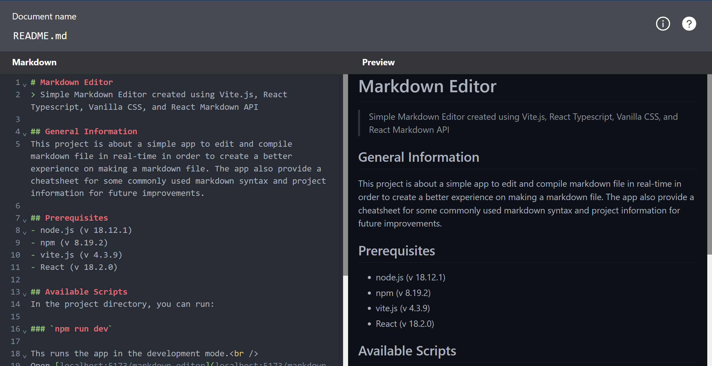

# Markdown Editor
> Simple Markdown Editor created using Vite.js, React Typescript, Vanilla CSS, and React Markdown API

## General Information
This project is about a simple app to edit and compile markdown file in real-time in order to create a better experience on making a markdown file. The app also provide a cheatsheet for some commonly used markdown syntax and project information for future improvements.

## Prerequisites
- node.js (v 18.12.1)
- npm (v 8.19.2)
- vite.js (v 4.3.9)
- React (v 18.2.0)

## Available Scripts
In the project directory, you can run:

### `npm run dev`

Ths runs the app in the development mode.

The page will reload if you make edits. 
You will also see any lint errors in the console.

## Screenshots

## Contributors
